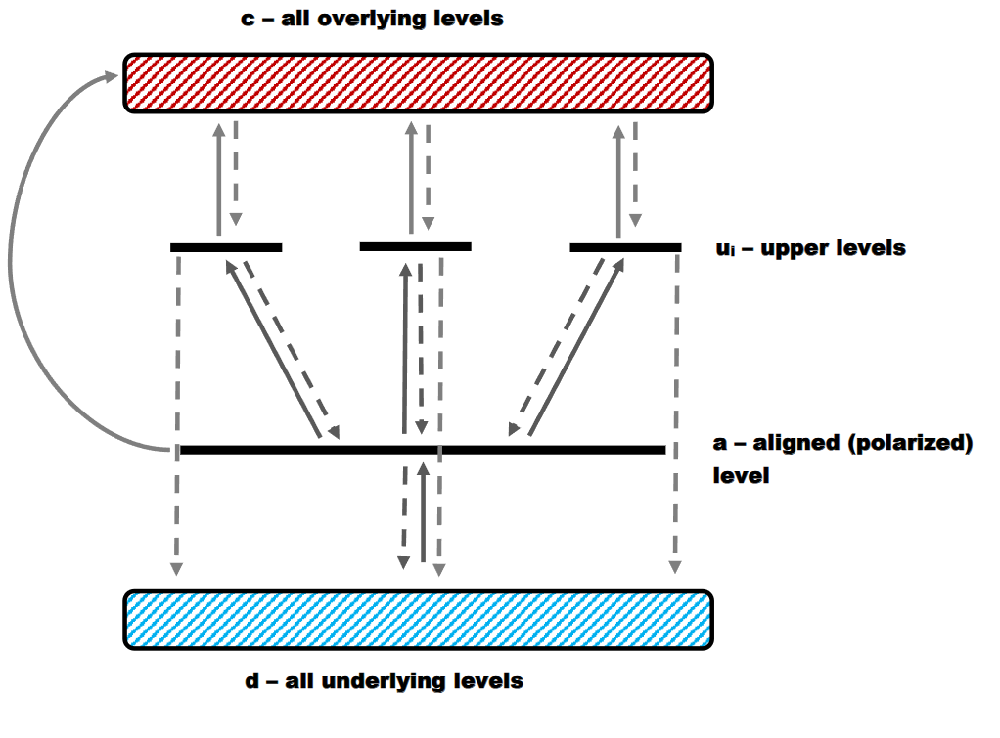

# NIST Triplet Finder

This repository contains a Python script for automated search and filtering of **triplet spectral transitions** from the [NIST Atomic Spectra Database](https://physics.nist.gov/PhysRefData/ASD/lines_form.html).  
The code identifies transitions that can exhibit **atomic alignment effects**, based on a set of physical selection criteria ([Rumenskikh et al. 2025](https://doi.org/10.1093/mnras/staf1038)). The primary motivation for searching for alignment-sensitive spectral lines is to enable the remote determination of magnetic field strengths from the observed absorption spectra of these lines. Such diagnostics can be used to probe magnetic fields in (exo)planetary atmospheres, nebulae, and stellar environments.

---

## Overview

The script loads atomic line data for a given atom or ion and applies a series of filters to find triplets that satisfy specific quantum-mechanical conditions.  
These include requirements on level configurations, total angular momenta, metastability of lower levels, and spectral separations.



Following the work of [Rumenskikh et al. 2025](https://doi.org/10.1093/mnras/staf1038), we briefly summarize the physical origin of the atomic alignment effect and the main criteria required for its occurrence.

**Fundamental requirements for atomic alignment**

- The aligned level *a* must be long-lived.
- The total angular momentum of the lower level *a* must satisfy $J > 1/2$, meaning that the level possesses at least two magnetic sublevels. Atomic alignment exists only through population imbalances among magnetic sublevels.
- Anisotropic radiation must excite level *a* faster than the processes responsible for depolarizing it.

**Additional observational requirements**

- Within the target multiplet transition, the wavelength separation between at least two lines must exceed 0.8 Å, allowing the lines to be resolved by modern spectroscopic instruments.
- The primary wavelength range considered is 500–1500 nm, reflecting the capabilities of the major observational facilities currently available.

We restrict our search to triplet upper levels because they provide the strongest observational signatures. If only a single spectral line is available, it becomes impossible to uniquely infer the magnetic field strength, since the observed absorption profile can often be reproduced by adjusting other atmospheric parameters, such as species abundances, stellar-wind properties, metallicity ([Fe/H]), and so forth. In general, the larger the number of lines within a transition, the more effectively modeling degeneracies can be reduced.

On the other hand, atomic alignment often involves excited states whose populations are relatively small. As a result, although the alignment effect itself may be present, its observational signatures in absorption spectra become weaker. Triplets therefore represent a practical compromise between observational detectability and diagnostic power.

It should be emphasized that the [NIST Atomic Spectra Database](https://physics.nist.gov/PhysRefData/ASD/lines_form.html) does not provide transitions between individual magnetic sublevels, which are the quantities directly relevant to atomic alignment. Instead, it lists transitions between terms characterized by the total angular momentum quantum number $J$. Furthermore, transition probabilities ($f_{ik}$) between magnetic sublevels are generally unavailable; only values averaged over the corresponding sublevels are tabulated.

Consequently, our search in the NIST database is limited to triplet transitions, namely transitions from a given lower term to exactly three upper terms that differ only in their total angular momentum $J$. At the same time, it should be kept in mind that the lower term actually consists of $2J_a+1$ magnetic sublevels, while each of the three upper terms represents a set of $2J_{u1}+1$, $2J_{u2}+1$, and $2J_{u3}+1$ magnetic sublevels, respectively.

Therefore, the purpose of the present code is only to provide a very coarse preselection of transitions that: (a) are fundamentally capable of supporting atomic alignment; and (b) can maintain a sufficiently long-lived population under the combined action of photoexcitation and spontaneous radiative relaxation.

Determining whether atomic alignment actually occurs in a given transition, as well as evaluating its magnitude, requires a full quantum-mechanical treatment of the coupled system of magnetic sublevels.

Let us now examine the selection criteria in more detail. As a first approximation, we neglect collisions and other processes that may modify the level lifetimes.

For atomic alignment to develop, the atom must undergo several tens of excitation–deexcitation cycles of the form $a \rightarrow u_i \rightarrow a \rightarrow u_i \rightarrow \cdots$ This requires the aligned level $a$ to be metastable in the sense that its decay rate $A(a \rightarrow d)$ must be lower than the decay rates of the upper levels $A(u_i \rightarrow a)$. At the same time, the photoexcitation rate $R(a \rightarrow u_i)$ must exceed the decay rate $A(a \rightarrow d)$. More precisely, this requirement can be expressed as

$$R(a \rightarrow u_i) \gg A(a \rightarrow d),$$

meaning that the level participates in many excitation cycles before its population is lost.

Next, we must account for the fact that the upper levels $u_i$ may decay not only back to $a$, but also to any other allowed lower level $d$. To prevent population leakage from the alignment cycle, the relaxation rate $A(u_i \rightarrow a)$ must dominate over all competing decay channels $A(u_i \rightarrow d)$.

For each upper level, we therefore introduce a branching ratio

$$
\beta_i =
\frac{A(u_i \rightarrow a)}
{\sum_k A(u_i \rightarrow k)}.
$$

If $\beta_i \approx 1$, nearly all atoms return to level $a$. Conversely, if $\beta_i \ll 1$, photoexcitation to level $u_i$ effectively removes atoms from the alignment cycle, making the corresponding transition unsuitable for our purposes.

Under these conditions, the system of levels can be regarded as quasi-isolated, provided that both of the above requirements are satisfied.

To quantify the efficiency of the alignment cycle, we define an effective cycling rate as

$$R_{\mathrm{cyc}} = \sum_i R(a \rightarrow u_i),\beta_i .$$

To illustrate its meaning, consider a single upper level $u$. If the level decays back to $a$ with a probability of 90% and to other lower levels with a probability of 10%, then $\beta$ = 0.9. Out of 100 excitation events, approximately 90 atoms remain within the alignment cycle, while 10 are lost to other states. The effective cycling rate is therefore $R(a \rightarrow u)\beta$.

Physically, $R_{\mathrm{cyc}}$ represents the number of times per second that an atom completes the cycle $a \rightarrow u_i \rightarrow a$.

Consequently, a transition can be considered quasi-isolated only if all of the conditions described above are satisfied simultaneously.

Some precomputed results for different stars can be found in the `results` directory. For each star, two sets of results are provided: one obtained using a Planck spectrum (`sun_planck_vacuum/...`) and another using a model stellar spectrum (`sun_vacuum/...`). All wavelengths are given in vacuum, following the NIST convention.

---

## Features

- Queries NIST line data via [`astroquery.nist`](https://astroquery.readthedocs.io/en/latest/nist/nist.html)
- Parses and cleans the results into a structured `pandas.DataFrame`
- Finds triplet transitions that share the same electron configuration and term
- Filters lines by:
  - wavelength range (e.g., 5000–15000 Å, variable)
  - total angular momentum \( J > 1/2 \)
  - spectral separations \( > 0.8 \) Å (variable)
  - metastable lower levels (based on Einstein A-coefficients and photoexcitation rates)
- Exports full datasets or filtered triplets to tab-separated files

**Important notes**

Some potentially suitable transitions may be missed because, for certain elements, the NIST Atomic Spectra Database does not provide the required $A_{ik}$ and $f_{ik}$ coefficients. In such cases, the decay rates of the corresponding levels cannot be determined reliably, making it impossible to evaluate the selection criteria described above. These transitions are therefore excluded from consideration. However, if the missing data correspond to the ground state of the ion, the level is recorded

---

## Dependencies

- Python ≥ 3.9  
- [pandas](https://pandas.pydata.org/)  
- [numpy](https://numpy.org/)  
- [astropy](https://www.astropy.org/)  
- [astroquery](https://astroquery.readthedocs.io/)  
- re (standard library)

You can install them via:

```bash
pip install pandas numpy astropy astroquery
```

---

## Usage

You can search for lines directly in this script's `main()` function.
To retrieve and fully process data, use only the `NIST_data` class constructor. It requires the name of an element similar to the [NIST](https://physics.nist.gov/PhysRefData/ASD/lines_form.html) database and the wavelength range for searching transitions in angstroms (the wider the range, the better). The found lines are saved in plain text format.

```python
#He I
    data = NIST_data(linename ='He I',
                     lambda1 = 1e-6,
                     lambda2 = 35e7,
                     in_vacuum = False,
                     sort_lambda1 = 5000,
                     sort_lambda2 = 15000,
                     system_name="Sun",
                     use_planck = True)
    
    data.save_triplets_formated()
```

The constructor accepts the following parameters:

- `linename` - the element name exactly as specified in the NIST Atomic Spectra Database.
- `lambda1`, `lambd2` - wavelength range to be downloaded from NIST.
- `in_vacuum` - whether wavelengths are given in vacuum (`True`) or in air (`False`). If air wavelengths are selected, all wavelengths below 180 nm are still reported in vacuum, following the NIST convention.
- `sort_lambda1`, `sort_lambda2` - дwavelength range within which suitable triplets will be searched for.
- `system_name` - the name of the stellar system defined in the `stellar_systems` dictionary. This is required for calculating photoexcitation rates, which depend on the stellar radiation field. If no stellar spectrum is available, a Planck spectrum corresponding to the star's effective temperature is used instead.
- `use_planck` - if set to `True`, a Planck spectrum will be used regardless of whether an observed stellar spectrum is available.

The `save_triplets_formatted()` method saves the selected triplets in a human-readable format.

Users may add their own stellar systems by creating a new file inside the `\star_data` directory. For example, create a file named `my_awesome_star.py` and define NumPy arrays containing the stellar spectrum and corresponding wavelengths, following the format used by the existing examples.

Note that the stellar spectrum must be provided in units of erg cm$^{-2}$ s$^{-1}$ at the orbital distance of the planet. Wavelengths must be specified in Ångströms.

Finally, add the new system to the dictionary in `stellar_systems.py`:

```python
from . import my_awesome_star

stellar_systems = {
    "Sun" : StellarSystem(name = "Sun",
                          Teff = 5780,
                          Rstar_Rsun = 1.0,
                          orbital_distance_AU = 1.0,
                          spectrum_wl = sun_spectrum.sun_wl,
                          spectrum_flux =sun_spectrum.sun_flux),
                          
    "My_awesome_star" : StellarSystem(name = "My_awesome_star",
                          Teff = 1e6,
                          Rstar_Rsun = 10,
                          orbital_distance_AU = 0.03,
                          spectrum_wl = my_awesome_star.wavelength_array,
                          spectrum_flux = my_awesome_star.flux_array)
}
```

Also, do not forget to import your spectrum file by adding `from . import my_awesome_star` to the corresponding module.

The dictionary fields are defined as follows:

- `Teff` - stellar effective temperature in Kelvin.
- `Rstar_Rsun` - stellar radius in units of the solar radius.
- `orbital_distance_AU` - orbital semi-major axis of the planet (or, more generally, the distance at which atomic alignment is being evaluated). The input spectrum must correspond to this distance.
- `spectrum_wl` - NumPy array of wavelengths in Ångströms.
- `spectrum_flux`- NumPy array of the radiation flux at the orbital distance, in units of erg cm$^{-2}$ s$^{-1}$.

All other methods of the package may also be used. Their functionality is documented directly in the source code. However, the description provided above is sufficient to perform calculations without modifying the code itself, except for adding a custom stellar system when necessary.

**Important**
The script returns all **Ritz** wavelengths in vacuum/air in angstroms. Please keep this in mind when comparing with NIST.

---

## Interpretation of result

In our code, we first select all fundamentally suitable triplet transitions and then filter them according to the spectral resolution required to separate the individual lines and the wavelength range of interest. For each potentially alignable triplet, we calculate a set of key metrics characterizing the feasibility of atomic alignment:

- $\Gamma_a$ (Gamma_a) — decay rate of the aligned level [$s^{-1}$]. Its inverse corresponds to the radiative lifetime of the level.

- $R_{exc}$ — total photoexcitation rate from the aligned level [$s^{-1}$].

- $Q = R_{exc} / \Gamma_a$ — ratio of the photoexcitation rate to the decay rate of the level. It indicates how many times faster photoexcitation occurs compared to spontaneous decay.

- $\beta_i$ (beta) — branching ratio for the decay of the upper level back to the aligned level. Values closer to unity are more favorable, as they correspond to a larger fraction of atoms returning to the alignment cycle.

- $R_{cyc}$ — atomic cycling rate, characterizing the number of alignment cycles completed per second.

- $Q_{cyc} = R_{cyc} / \Gamma_a$ — number of alignment cycles an atom undergoes during the lifetime of the aligned level. This is the primary figure of merit used to rank all triplets: the larger its value, the more favorable the triplet. We estimate that $Q_{cyc}$ should be at least several tens for the alignment effect to be significant.

As a result, we obtain a table of selected triplets together with all of the above metrics. **It is important to note that, because the photoexcitation rate depends on the stellar radiation field, the atomic alignment effect is highly sensitive to the properties of the host star. Therefore, a separate analysis is required for each stellar spectrum**.

---

## Troubleshooting

Several errors may occur during operation:

- The NIST database may report that the required data was not found (if you specified the element correctly):
In this case, it is recommended to slightly change the search wavelength range, and then everything will work (a feature of the `astroquery` library).
- The script reports that lower levels were not found for a certain lower level, which prevents metastability assessment. In this case, the transition is not taken into account. To correct this, try specifying a shorter wavelength.
- Errors in parsing table data. Not all available elements in [NIST](https://physics.nist.gov/PhysRefData/ASD/lines_form.html) have been checked, and there may be a data format we haven't accounted for. If you encounter this issue, please let us know.

---

## Developed by

**Stas Sharipov**  
Laboratory of High-Power Laser Energy, Institute of Laser Physics SB RAS 
GitHub: [@SinjiBaka](https://github.com/SinjiBaka)
